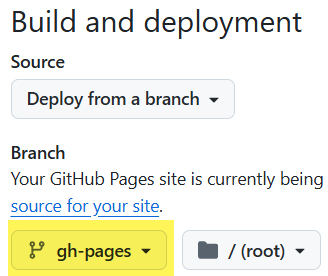
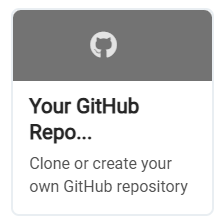
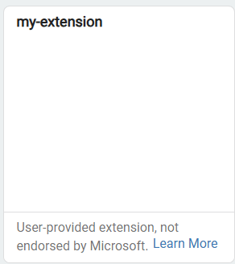
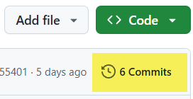

# `simx-sample` Simulator Extension

## Overview

This guide walks you through the process of developing and testing a MakeCode extension that includes a simulator extension (_simx_).

Simulator extensions are implemented as part of a standard MakeCode extension, but are organized as a separate project in a subfolder. This keeps them distinct from the main extension’s code. The development workflow is different for each.

In the steps below, you will:

* **Set up for local MakeCode development**
* **Run the local MakeCode server**
* **Fork this repository and rename**
* **Develop the code extension in MakeCode**
* **Develop the simulator extension in vscode**
* **Register the simulator extension**
* **Test the extension end to end**
* **Publish your simulator extension**

> [!NOTE]
> The following instructions assume your extension targets microbit. If you're developing for a different target (e.g. Arcade), simply replace `pxt-microbit` with the appropriate repository name (e.g. `pxt-arcade`). All other steps remain the same.

## Set up for local MakeCode development

1. **Get setup for local MakeCode development**

    Follow the instructions [here](https://github.com/microsoft/pxt-microbit#local-server-setup) to get setup for local MakeCode development, **with one important modification**: Because you will be creating a pull request for your extension registration, **fork the target repo** rather than simply cloning it.

> [!IMPORTANT]
> Where the linked instructions say to clone the `pxt-microbit` repo, you will _clone your fork_ of the `pxt-microbit` repo.

2. **Run local MakeCode server**

    Ensure you can successfully host the MakeCode editor locally.

    Ensure that you can successfully host the MakeCode editor locally by following the [instructions here](https://github.com/microsoft/pxt-microbit#running). You should see MakeCode load in a browser, served from `http://localhost:3232`.

> [!TIP]
> You may have to restart `pxt serve` occasionally. After running it once, the essential packages will have been built. To skip rebuilding them on subsequent runs, add the __--just__ argument.
>
> If you don't want `pxt serve` to open a new browser tab every time you start it, add the __--noBrowser__ argument.
>
> ```bash
> pxt serve --just --noBrowser
> ```

## Fork and rename the `simx-sample` repository

To create a new simulator extension, **fork this repo** to your organization's GitHub and **rename the repo** to fit your project.

  

### Configure GitHub Pages

Released simulator extensions are hosted on GitHub Pages, so we'll set that up now.

1. Run the **Build Simulator Extension** GitHub Action. This will build and publish your _simx_ to a branch named `gh-pages`.

  

  Wait for the build to complete.

2. From your repo main page, click **Settings**, then **Pages** (under _Code and automation_). Beneath **Build and deployment**, in the **Branch** dropdown, choose the `gh-pages` branch.

  

## Develop the code extension

The code portion of your extension is developed in the MakeCode editor. You need to import your GitHub project into MakeCode to allow syncing of changes.

### Import repo to MakeCode

Import your newly cloned repo into MakeCode as a new project.

1. On the MakeCode home page, click the **Import** button:
  
  

2. Choose the **Import GitHub Repo** option. This will link your local project and the source repo, allowing MakeCode to sync changes from the editor.

  

3. Once the project opens, it will still be named 'simx-sample'. Go ahead and **rename your project**.

  

4. Update the message channel.

  The message channel is a unique string that identifies messages as belonging to your extension. It must be changed to to match your extension name.

  - Switch to the JavaScript editor
  - Expand the file explorer below the simulator
  - Open the `custom.ts` file
  - Update the value of SIMX_CHANNEL:

      

      Bonus: Update the namespace name as well. This will change the name of the category where your extension's blocks show up in the toolbox.

5. Push your changes to GitHub.

You are now set up to develop the code portion of your extension! See [this page](https://github.com/microsoft/pxt/blob/master/docs/extensions.md) for more information on extension development.


## Develop the simulator extension

As noted earlier, the simulator extension is a web application. As such, development is done using tools and workflows that will be familiar to many developers. To get started:

### Clone your new repo

  Clone the repo to your local machine.

  On a command prompt:

  ```bash
  > git clone https://github.com/your-org/my-extension
  ```

### Install _simx_ dependencies

  On the same command prompt:

  ```bash
  > cd my-extension/simx
  > npm i
  ```

### Open cloned folder in your preferred editor

These instructions will assume Visual Studio Code, but any editor will do.

Even though your changes in this repo will be scoped to the `simx` folder, go ahead and open the repo root in your editor.

### Rename the webapp

Internally, the webapp will still be named "@eanders-ms/simx-sample". Open the file `simx/package.json` and updated the name (e.g. "@your-org/my-extension"), then push your changes to GitHub.

### Run the local dev server

On a command prompt open to the `simx` folder, start the dev server.

```bash
> npm run dev
```

This will start a development server. Make note of the localhost URL and port number. For these instructions we will assume `http://localhost:5173`

## Register your extension with pxt-microbit

1. Open your cloned `pxt-microbit` folder in vscode.

2. Open the file `targetconfig.json`.

3. Find the `approvedRepoLib` section.

4. At the end of this section, add an entry for your new extension:

    ```json
    "your-org/my-extension": {
      "simx": {
        "sha": "", // Leave this empty for now
        "devUrl": "http://localhost:5173"
      }
    }
    ```

5. For this configuration change to take effect, you must restart `pxt serve` and refresh your MakeCode tabs.

### Edit your _simx_ webapp

The simulator extension is located in the `/simx` folder. During _simx_ development, you'll generally make changes only to the files within this folder.

The `simx-sample/simx` webapp was created with [Vite](https://vitejs.dev) + [React](https://react.dev) + [TypeScript](https://typescriptlang.org). None of these frameworks are required. You are free to use any framework you like, as long as the app is packaged as a static web application.

## Test your extension in MakeCode

To test your extension end to end, you will create a new MakeCode project to integrate them.

1. In your browser, make a new tab, open your locally running MakeCode editor there (e.g. `http://localhost:3232`), and create a new project.

2. Add your extension to the project from GitHub URL:

    Click the extensions toolbox category

    

    Enter your GitHub repo URL and press Enter

    

    Add your extension to the project

    

3. Instruct MakeCode to load your simulator extension from the local dev server by adding the `simxdev` URL parameter.

> [!NOTE]
> This parameter only works run hosting MakeCode locally.

4. Once the page reloads, you should see your simulator extension load below the main simulator!


### Refreshing the code extension

When you make changes to your code extension and push them to GitHub, you will need to pull those changes into your test project. This is done by refreshing the dependency in the File Explorer:

  

> [!NOTE]
> The File Explorer is not accessible from the Blocks editor. Switch to JavaScript to find it.

### Refreshing the simulator extension

When serving your _simx_ from the local dev server, your changes should reload automatically. No need to push anything to GitHub.

## Publishing your simulator extension

To test your _simx_ online or to release it, you must publish it to GitHub Pages.

1. Commit and push your changes to GitHub.

2. Run the **Build Simulator Extension** GitHub Action, which will publish your _simx_ to the `gh-pages` branch.

### Test your published _simx_

3. Your published _simx_ is now publicly accessible at https://your-org.github.io/my-extension. Update `devUrl` in `targetconfig.json` to this value. Your updated registration will look something like:

    ```json
    "your-org/my-extension": {
      "simx": {
        "sha": "",
        "devUrl": "https://your-org.github.io/my-extension"
      }
    }
    ```

4. Restart `pxt serve` to pick up this config change.

5. In your MakeCode test project, refresh the page. Verify in devtools that your _simx_ is loading from github.io.


## Releasing your simulator extension

When ready to release your extension:

1. Go to the `gh-pages` branch on GitHub and copy the full commit SHA of the latest version.

    

    

    

2. Update the `sha` field of your extension registration in `targetconfig.json` with this value, so your updated registration looks something like this:

    ```json
    "your-org/my-extension": {
      "simx": {
        "sha": "6555401f995fac26ebafbaf1f1b1261ae72a05b3",
        "devUrl": "https://your-org.github.io/my-extension"
      }
    }
    ```

3. Open a pull request from your fork of `pxt-microbit` to `microsoft/pxt-microbit`.

The MakeCode team will review your extension and communicate a release timeline.